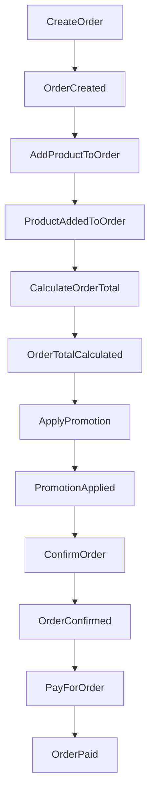
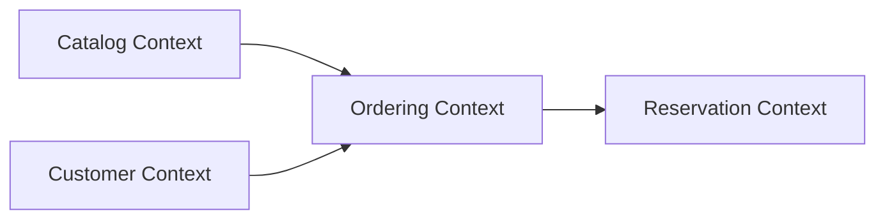

# 📝 Laboratory Work №3
# Domain Analysis and Transition from Layered Architecture to DDD

- **Discipline:** Domain Engineering Technologies
- **Project:** BoardGameShop
- **Theme:** Transition from Classical Layered Architecture to Domain-Driven Design
- **Repository:** https://github.com/AvdikR/BoardGameShop

---

# 1. Загальний опис проєкту

Проєкт `BoardGameShop` представляє собою RESTful Web API застосунок для онлайн-магазину настільних ігор, реалізований за допомогою `.NET 10` та `ASP.NET Core`.

Початкова архітектура системи будувалася за принципами класичної шарової архітектури та була орієнтована переважно на CRUD-операції й структуру бази даних. Під час виконання лабораторної роботи система була переосмислена з точки зору Domain-Driven Design (DDD), де основний фокус зміщується з таблиць БД на бізнес-процеси, бізнес-правила та межі відповідальності.

На поточному етапі система підтримує:

- управління каталогом настільних ігор;
- створення та оформлення замовлень;
- життєвий цикл замовлення;
- розрахунок знижок та промоакцій;
- базову модель бронювання ігрових сесій та столів.

> Авторизація та автентифікація користувачів тимчасово відсутні, оскільки основна увага приділяється моделюванню домену та реалізації бізнес-логіки.

---

# 2. Етап 1 — Domain Events, Commands та Aggregates

## 2.1 Domain Events

Domain Events описують важливі бізнес-події, які вже відбулися у системі.

### Catalog Context

- `ProductCreated`
- `ProductPriceUpdated`
- `ProductStockChanged`
- `ProductMarkedForPreorder`
- `ProductCatalogAssigned`

### Ordering Context

- `OrderCreated`
- `ProductAddedToOrder`
- `OrderConfirmed`
- `OrderPaid`
- `OrderCancelled`
- `OrderShipped`
- `OrderDelivered`
- `PromotionApplied`
- `LoyaltyDiscountApplied`
- `OrderTotalCalculated`

### Customer Context

- `CustomerInformationProvided`
- `CustomerLoyaltyTierUpdated`

### Reservation Context

- `ReservationCreated`
- `ReservationCancelled`
- `GameSessionReserved`
- `SpaceReserved`

---

## 2.2 Commands

Commands описують дії користувача або системи, які призводять до виникнення Domain Events.

### Catalog Commands

- `CreateProduct`
- `UpdateProductPrice`
- `UpdateProductStock`
- `AssignProductToCatalog`
- `EnablePreorder`

### Ordering Commands

- `CreateOrder`
- `AddProductToOrder`
- `ConfirmOrder`
- `PayForOrder`
- `CancelOrder`
- `ShipOrder`
- `DeliverOrder`
- `ApplyPromotion`
- `CalculateOrderTotal`

### Customer Commands

- `ProvideCustomerInformation`
- `UpdateLoyaltyTier`

### Reservation Commands

- `CreateReservation`
- `ReserveGameSession`
- `ReserveSpace`
- `CancelReservation`

---

## 2.3 Aggregates

Aggregates визначають межі транзакційної цілісності та бізнес-інваріантів у домені.

---

### Order Aggregate

`Order` є центральним Aggregate Root системи.

Агрегат відповідає за:

- контроль життєвого циклу замовлення;
- перевірку коректності переходів між статусами;
- узгодженість `OrderItem`;
- розрахунок фінальної вартості;
- застосування знижок та промоакцій.

До агрегату входять:

- `Order`
- `OrderItem`

---

### Product Aggregate

`Product` агрегат відповідає за каталог товарів та їх бізнес-представлення.

Відповідальності агрегату:

- керування ціною;
- контроль доступності товару;
- підтримка передзамовлення;
- належність до каталогу.

---

### Customer Aggregate

`Customer` агрегат відповідає за контактні дані покупця та механізм лояльності.

На поточному етапі система використовує тимчасову модель клієнта без повноцінної авторизації.

---

### Reservation Aggregate

`Reservation` агрегат відповідає за процес бронювання ігрових сесій та фізичних місць.

Агрегат контролює:

- коректність бронювання;
- доступність місць;
- часові обмеження;
- максимальну кількість учасників.

---

## 2.4 Приклад взаємодії Domain Events та Commands

---

# 3. Етап 2 — Bounded Contexts

Система була поділена на декілька Bounded Context відповідно до бізнес-відповідальностей та семантичних меж.

---

## 3.1 Catalog Context

`Catalog Context` відповідає за представлення товарів для користувача.

У цьому контексті `Product` є маркетинговою одиницею каталогу, яка містить:

- опис гри;
- категорію;
- вартість;
- інформацію про передзамовлення;
- візуальне представлення товару.

### Основні відповідальності

- управління каталогом;
- категоризація товарів;
- оновлення цін;
- відображення доступності товару.

### Основні терміни

`Product`, `Catalog`, `Category`, `Price`, `Preorder`

---

## 3.2 Ordering Context

`Ordering Context` є центральним бізнес-контекстом системи.

У межах цього контексту `Order` розглядається не як таблиця БД, а як бізнес-процес оформлення покупки.

Контекст відповідає за:

- створення замовлення;
- управління статусами;
- розрахунок фінальної ціни;
- застосування акцій;
- перевірку бізнес-правил.

### Основні відповідальності

- checkout-процес;
- lifecycle management;
- pricing logic;
- discount calculation.

### Основні терміни

`Order`, `Checkout`, `Promotion`, `Discount`, `TotalPrice`, `Status`

---

## 3.3 Customer Context

`Customer Context` відповідає за роботу з інформацією про покупця.

На поточному етапі клієнт не є повноцінним акаунтом системи, а використовується як тимчасова модель контактної інформації при оформленні замовлення.

У майбутньому контекст може бути розширений до повноцінного Identity/Profile Management Context.

### Основні відповідальності

- збереження контактної інформації;
- підтримка loyalty logic;
- зв'язок покупця із замовленнями.

### Основні терміни

`Customer`, `Email`, `PhoneNumber`, `LoyaltyTier`

---

## 3.4 Reservation Context

`Reservation Context` відповідає за бронювання столів та ігрових сесій.

Процеси бронювання мають часові обмеження та залежать від доступності місць і максимальної кількості учасників.

### Основні відповідальності

- бронювання столів;
- реєстрація на GameSession;
- контроль доступності місць;
- керування часовими слотами.

### Основні терміни

`Reservation`, `GameSession`, `Space`, `Capacity`, `ReservationStatus`

---

## 3.5 Context Mapping

Нижче наведено спрощену схему взаємодії між Bounded Context.

### Опис взаємодії контекстів

- `Ordering Context` використовує інформацію про товари з `Catalog Context`.
- `Customer Context` надає контактні дані для оформлення замовлення.
- `Reservation Context` працює незалежно від процесу покупки, але може бути пов'язаний із клієнтом.
- `Ordering Context` є центральним бізнес-контекстом системи.

---

# 4. Етап 3 — Ubiquitous Language

## 4.1 Catalog Context Language

| Термін | Значення |
|---|---|
| `Product` | Настільна гра або товар магазину |
| `Catalog` | Набір товарів, згрупованих за категоріями |
| `Category` | Тип або жанр настільної гри |
| `Price` | Вартість товару |
| `Stock` | Доступна кількість товару |
| `Preorder` | Можливість оформлення передзамовлення |

---

## 4.2 Ordering Context Language

| Термін | Значення |
|---|---|
| `Order` | Бізнес-процес оформлення покупки |
| `OrderItem` | Окрема позиція у замовленні |
| `Checkout` | Процес підтвердження замовлення |
| `Promotion` | Правило застосування знижки |
| `TotalPrice` | Фінальна вартість замовлення |
| `Status` | Поточний стан замовлення |

---

## 4.3 Customer Context Language

| Термін | Значення |
|---|---|
| `Customer` | Покупець товарів |
| `Email` | Контактна електронна адреса |
| `PhoneNumber` | Контактний номер телефону |
| `LoyaltyTier` | Рівень лояльності клієнта |

---

## 4.4 Reservation Context Language

| Термін | Значення |
|---|---|
| `Reservation` | Операція бронювання |
| `GameSession` | Ігрова подія або DnD-сесія |
| `Space` | Ігровий стіл або кімната |
| `Capacity` | Максимальна кількість учасників |
| `ReservationStatus` | Поточний стан бронювання |

---

# 5. Висновок 🏁

У результаті виконання лабораторної роботи було проведено аналіз системи `BoardGameShop` з точки зору Domain-Driven Design.

Перехід від класичної CRUD-орієнтованої архітектури до доменно-орієнтованого підходу дозволив виділити ключові бізнес-процеси, межі відповідальності та точки транзакційної цілісності системи.

Під час роботи були визначені:

- Domain Events;
- Commands;
- Aggregates;
- Bounded Contexts;
- Ubiquitous Language.

Отримана модель демонструє можливість подальшої еволюції проєкту у напрямку Clean Architecture, більш ізольованих доменних модулів або мікросервісної архітектури.
