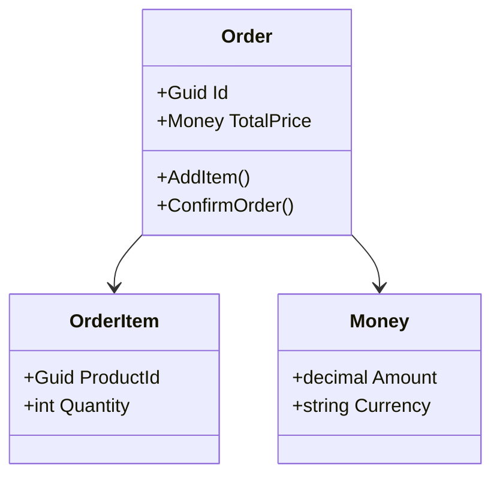
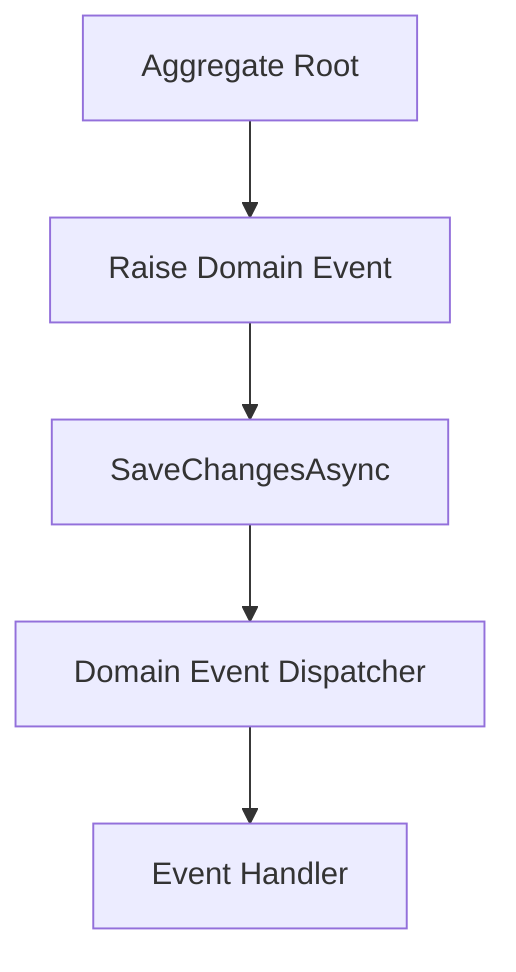
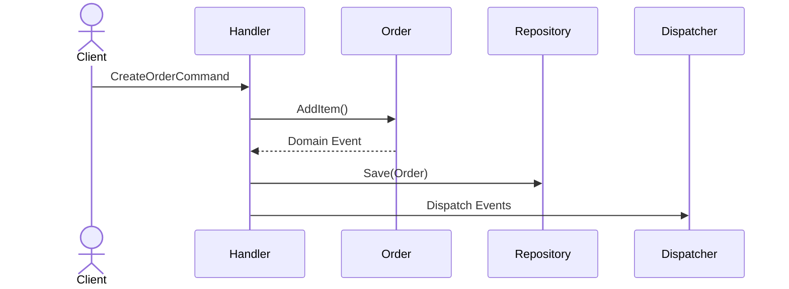

# 📝 Practical Work №4
# Domain Model Implementation and Tactical DDD Patterns

- **Discipline:** Domain Engineering Technologies
- **Project:** BoardGameShop
- **Theme:** Value Objects, Aggregate Root, Domain Events and Use Cases
- **Repository:** https://github.com/AvdikR/BoardGameShop

---

# 1. Project Overview

Проєкт `BoardGameShop` представляє собою RESTful Web API застосунок для онлайн-магазину настільних ігор, реалізований за допомогою `.NET 10` та `ASP.NET Core`.

На попередніх етапах система будувалась переважно на принципах класичної шарової архітектури, де доменні сутності виступали простими структурами даних. У межах даної практичної роботи було виконано перехід до tactical patterns Domain-Driven Design (DDD), де бізнес-логіка переноситься всередину доменного шару.

Основна увага приділялась:

- реалізації `Value Objects`;
- перетворенню `Order` на `Aggregate Root`;
- реалізації `Domain Events`;
- створенню `Domain Event Dispatcher`;
- реалізації `Use Case` через `Command Handler`.

---

# 2. Step 1 — Value Objects

## 2.1 Призначення Value Objects

У Domain-Driven Design `Value Object` використовується для представлення значень, які не мають власної ідентичності, але містять бізнес-сенс та правила валідації.

Value Objects дозволяють:

- централізувати бізнес-правила;
- уникнути дублювання валідації;
- зробити доменну модель більш виразною;
- забезпечити незмінність (immutability).

---

## 2.2 Money Value Object

Для представлення ціни товару та фінальної вартості замовлення був реалізований `Money Value Object`.

```csharp
public record Money(decimal Amount, string Currency)
{
    public static Money Create(decimal amount, string currency)
    {
        if (amount < 0)
            throw new ArgumentException("Amount cannot be negative");

        return new Money(amount, currency);
    }
}
```

### Основні переваги

- неможливість створення від’ємної ціни;
- централізована валідація;
- повторне використання в різних агрегатах;
- інкапсуляція логіки роботи з грошовими значеннями.

---

## 2.3 Інші можливі Value Objects

У проєкті також можуть використовуватись:

- `Email`
- `PhoneNumber`
- `Quantity`
- `Discount`
- `ReservationTimeSlot`

---

# 3. Step 2 — Aggregate Root

## 3.1 Order Aggregate Root

Центральним агрегатом системи було обрано `Order`.

У DDD-підході `Order` більше не є просто таблицею БД або DTO-моделлю. Агрегат відповідає за контроль власного стану та забезпечення бізнес-інваріантів.

---

## 3.2 Інкапсуляція бізнес-логіки

Для забезпечення консистентності:
- відкриті setters були замінені на `private setters`;
- модифікація стану виконується лише через бізнес-методи;
- усі перевірки виконуються всередині агрегату.

```csharp
public class Order : AggregateRoot
{
    public Guid Id { get; private set; }

    public Money TotalPrice { get; private set; }

    private readonly List<OrderItem> _items = new();

    public IReadOnlyCollection<OrderItem> Items => _items;

    public void AddItem(Product product, int quantity)
    {
        if (quantity <= 0)
            throw new ArgumentException("Quantity must be greater than zero");

        _items.Add(new OrderItem(product.Id, quantity, product.Price));

        RaiseDomainEvent(new ProductAddedToOrderEvent(Id, product.Id));
    }
}
```

---

## 3.3 Бізнес-інваріанти Aggregate Root

`Order Aggregate` забезпечує:

- контроль переходів між статусами;
- перевірку кількості товарів;
- узгодженість `OrderItem`;
- централізований розрахунок вартості;
- застосування бізнес-правил.

---

## 3.4 Aggregate Interaction Diagram



---

# 4. Step 3 — Domain Events

## 4.1 Призначення Domain Events

`Domain Events` використовуються для опису важливих бізнес-подій, які вже відбулися у системі.

Події дозволяють:
- зменшити зв’язність між компонентами;
- реалізувати реактивну архітектуру;
- відокремити бізнес-процеси.

---

## 4.2 Приклади Domain Events

У межах проєкту були визначені:

- `OrderCreatedEvent`
- `ProductAddedToOrderEvent`
- `OrderConfirmedEvent`
- `OrderPaidEvent`
- `PromotionAppliedEvent`

---

## 4.3 Приклад Domain Event

```csharp
public class OrderCreatedEvent : IDomainEvent
{
    public Guid OrderId { get; }

    public OrderCreatedEvent(Guid orderId)
    {
        OrderId = orderId;
    }
}
```

---

# 5. Step 3 — Domain Event Dispatcher

## 5.1 Dispatcher

Після збереження агрегату необхідно автоматично обробити всі накопичені доменні події.

Для цього використовується `DomainEventDispatcher`.

```csharp
public interface IDomainEventDispatcher
{
    Task DispatchAndClear(IEnumerable<AggregateRoot> entities);
}
```

---

## 5.2 Dispatcher Workflow



---

## 5.3 Призначення Dispatcher

Dispatcher:
- збирає події з агрегатів;
- передає їх обробникам;
- очищує список подій після обробки;
- дозволяє ізолювати бізнес-процеси.

---

# 6. Step 4 — Use Case / Command Handler

## 6.1 Призначення Command Handler

`Command Handler` виконує orchestration бізнес-процесу та координує взаємодію між Application Layer і Domain Layer.

Основні етапи:
1. Завантаження необхідних даних.
2. Виклик бізнес-методів агрегату.
3. Збереження агрегату.
4. Dispatch Domain Events.

---

## 6.2 CreateOrderCommand

```csharp
public record CreateOrderCommand(
    Guid ProductId,
    int Quantity,
    string CustomerName
);
```

---

## 6.3 CreateOrderCommandHandler

```csharp
public class CreateOrderCommandHandler
{
    public async Task Handle(CreateOrderCommand command)
    {
        var product = await _productRepository.GetById(command.ProductId);

        var order = new Order();

        order.AddItem(product, command.Quantity);

        await _orderRepository.Save(order);

        await _domainEventDispatcher.DispatchAndClear(new[] { order });
    }
}
```

---

## 6.4 Use Case Flow



---

# 7. Conclusion 🏁

У результаті виконання практичної роботи було реалізовано основні tactical patterns Domain-Driven Design у межах проєкту `BoardGameShop`.

Було виконано:
- реалізацію `Value Objects`;
- перетворення `Order` на `Aggregate Root`;
- створення `Domain Events`;
- реалізацію `Domain Event Dispatcher`;
- реалізацію `Use Case` через `Command Handler`.

DDD-підхід дозволив зробити доменну модель:
- більш інкапсульованою;
- більш орієнтованою на бізнес-логіку;
- менш залежною від інфраструктурного шару;
- більш готовою до масштабування.

Отримана архітектура створює основу для подальшого переходу до `Clean Architecture`, `CQRS` або мікросервісного підходу.
